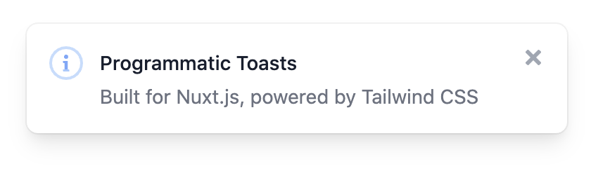

<p align="center">
  
</p>

[](https://nuxtjs.org)
[](https://www.npmjs.com/package/tv-toast)
[](https://www.npmjs.com/package/tv-toast)
[](https://discord.gg/enn4S6)
[](https://www.npmjs.com/package-tv-toast)


> programmatic toasts for [Nuxt.js](https://nuxtjs.org) powered by [Tailwind CSS](https://tailwindcss.com)

## Quick Setup
1. Add the `nuxt-tv-toast` dependency to your Nuxt.js project
```bash
npm install nuxt-tv-toast
# OR
yarn add nuxt-tv-toast
```

2. Add `nuxt-tv-toast` to the `modules` section of `nuxt.concifg.js`
```js
{
  modules: [
    'nuxt-tv-toast'
  ]
}
```

3. If you're using [Purge](https://tailwindcss.com/docs/controlling-file-size), add this module to the content section of `tailwind.config.js`

```js
module.exports = {
    content: [
      './node_modules/tv-toast/**/*.vue'
  }
```


## Usage

```js
this.$toast.show('Keeping it simple')
```


```js
  this.$toast.show({
    type: 'success',
    title: 'Success',
    message: 'This is a successful toast',
  })
```


```js
  this.$toast.show({
    type: 'danger',
    title: 'Error',
    message: 'Please specify an e-mail address',
  })
```


```js
  this.$toast.show({
    message: 'Single action toast',
    primary: { label: 'UNDO', action: () => alert('primary') },
    timeout: false,
  })
```


```js
  this.$toast.show({
    title: 'Toast with actions',
    message: 'This toast has multiple actions',
    primary: { label: 'Primary', action: () => alert('primary') },
    secondary: { label: 'Secondary', action: () => alert('secondary') },
    timeout: false,
  })
```

